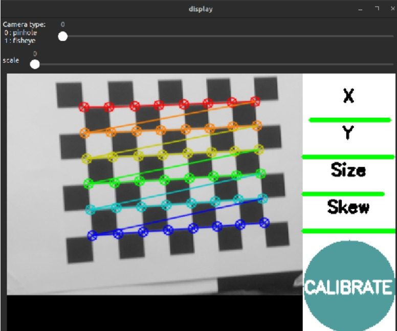
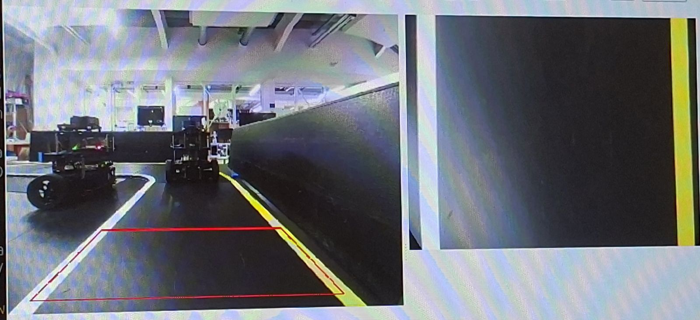
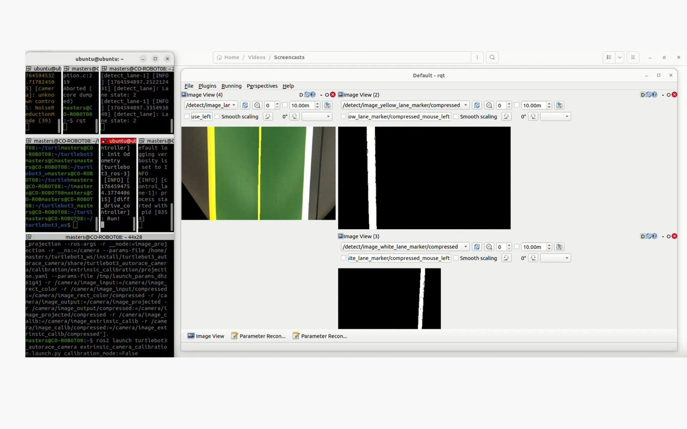
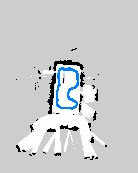
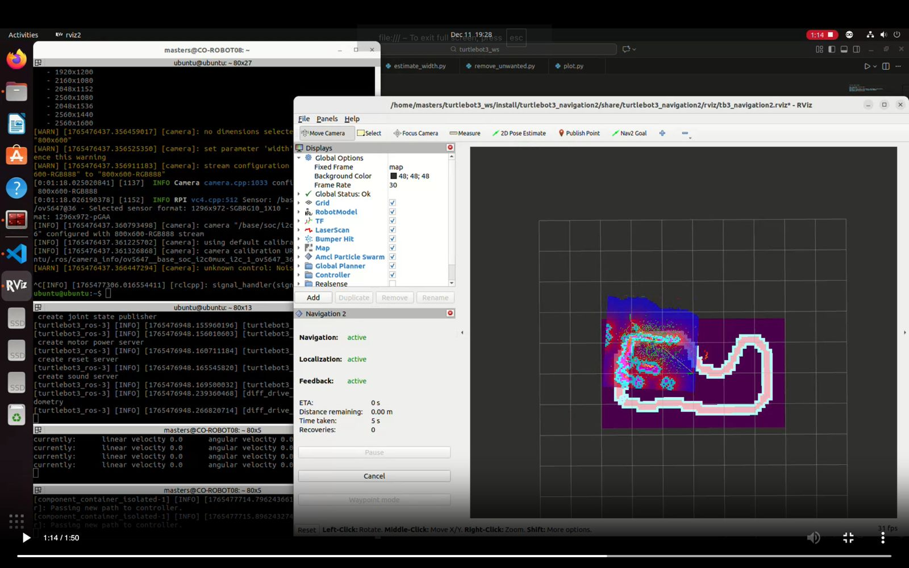

# robotics_ros2
# Autonomous-Driving Turtlebot3 Using Camera based Lane Tracking

Submitted By: Adel KANSO and Mariam Janbein
Supervised by: Joaquin Jorge Rodriguez

## Project Goal
Autonomous Driving of a Ground Differential Robot by Perception based on [Autorace Challenge][1]. Main task was to detect the lanes and make the robot follow lane and complete the mission. In the circuit provided robot has to go through a low light tunnel also.

## Required Libraries and Packages to Start
sudo apt install ros-humble-navigation2 ros-humble-nav2-bringup
sudo apt install ros-humble-turtlebot3*

## Complete report

## ScreenShots
### Calibration 

### Projected image 

### Lane Detection 

### Slam Map 

### Trajectory on Map 

### Trajectory Map 

### Navigation 

## Demo
### Lane Detection 

### Collect the surrounding  

### Navigation  

##PS: Developed with ROS2 humble 

